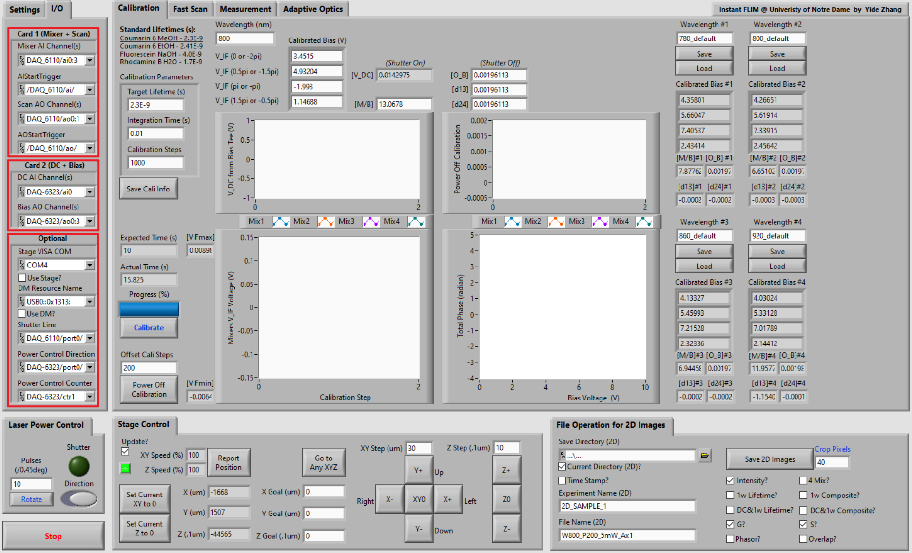
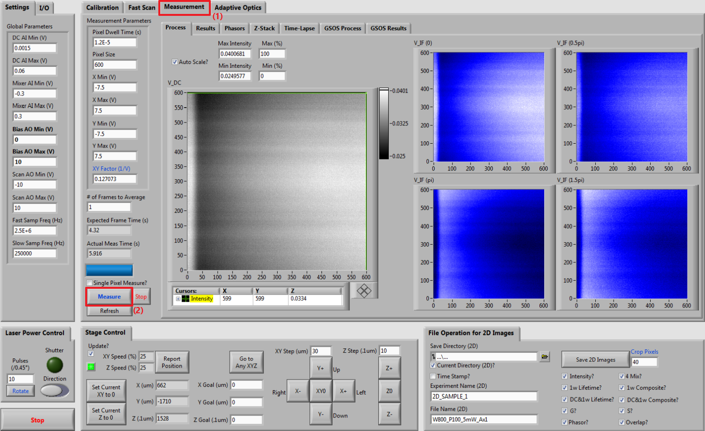
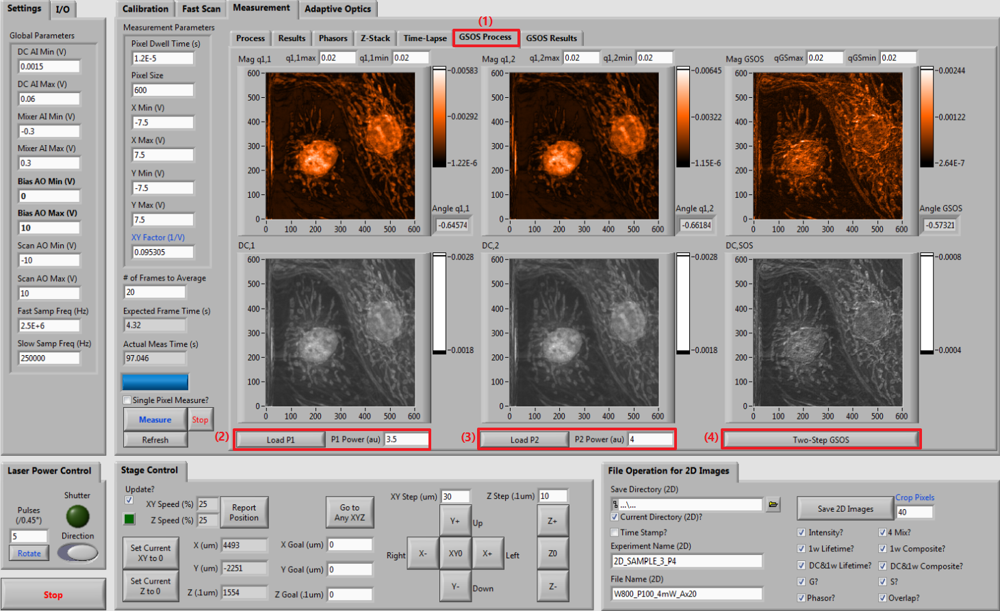

# Instant-FLIM-Control
An open-source LabView program that controls the [instant FLIM](http://www.osapublishing.org/optica/abstract.cfm?URI=optica-8-6-885) system.

```latex
@article {InstantFLIM2020,
    author = {Yide Zhang and Ian H. Guldner and Evan L. Nichols and David Benirschke and Cody J. Smith and Siyuan Zhang and Scott S. Howard},
    journal = {Optica},
    number = {6},
    pages = {885--897},
    publisher = {OSA},
    title = {Instant FLIM enables 4D in vivo lifetime imaging of intact and injured zebrafish and mouse brains},
    volume = {8},
    month = {Jun},
    year = {2021},
    url = {http://www.osapublishing.org/optica/abstract.cfm?URI=optica-8-6-885},
    doi = {10.1364/OPTICA.426870},
}
```

## 1. Introduction

Instant-FLIM-Control is an open-source LabView program that permits full
control of the instant FLIM hardware system. The program allows users to
acquire, analyze, and export FLIM images based on the principle of
instant FLIM. The program is fully open-source and highly modularized
(see the screenshots of the source code below), so users with LabView
programming skills can easily modify the code to customize existing
functions or to add new functions.


## 2. Installation

-   Install LabView 2015 (or newer) on your computer.

-   Download or clone (git clone) this GitHub repository:

    <https://github.com/yzhang34/Instant-FLIM-Control.git>

-   Open the project "Event-driven MPM-FLIM imaging platform.lvproj" in
    LabView and run the file "Main.vi" to execute the program:


## 3. Hardware Configuration (<span style="color:red">Updated</span>)
This step is to establish the connection between the LabView software
and the instant FLIM hardware. Use the pop-up menus in the "I/O" tab to
configurate the input and output ports.



The current implentation of the program requires <span style="color:red">two NI DAQ cards</span> that support NI-DAQmax. 

- <span style="color:red">Card 1</span>, e.g., NI PCI-6110, should have at least 4 analog input (AI) channels and 2 ananlog output (AO) channels.

- <span style="color:red">Card 2</span>, e.g., NI PCIe-6323, should have at least 1 AI channel and 4 AO channels.

Note:

- <span style="color:red">Card 1</span> and <span style="color:red">Card 2</span> should be synchronized using a Real-Time System Integration (RTSI) bus: <https://www.ni.com/en-us/support/documentation/supplemental/18/real-time-system-integration--rtsi--and-configuration-explained.html>

- For a complete list of devices that support NI-DAQmx, please check: <https://www.ni.com/pdf/manuals/374768ae.html>

- If you do not have cards with 4 AI + 2 AO or 1 AI + 4 AO channels, please contact me at <yzhang34@caltech.edu>. I can provide other versions of the program that would work for your applications. However, you need to make sure that all your cards combined have at least 5 AI channels and 6 AO channels.

The following ports and channels should be configurated before running
the program:

-   Mixer AI Channel(s)

    -   Configurate 4 AI channels of <span style="color:red">Card 1</span> (e.g.,
        NI PCI-6110) to read the IF voltages of the
        four mixers in instant FLIM

-   AIStartTrigger

    -   Configurate ai/StartTrigger of <span style="color:red">Card 1</span> (e.g.,
        NI PCI-6110) to synchronize with <span style="color:red">Card 2</span>


-   Scan AO Channel(s)

    -   Configurate 2 AO channels of <span style="color:red">Card 1</span> (e.g., NI PCI-6110) to generate the controlling voltages for
        the galvo scanners (e.g., Thorlabs GVS002); AO1 and AO2 for fast
        and slow scanning axes, respectively

-   AOStartTrigger

    -   Configurate ao/StartTrigger of <span style="color:red">Card 1</span> (e.g.,
        NI PCI-6110) to synchronize with <span style="color:red">Card 2</span>

-   DC AI Channel(s)

    -   Configurate 1 AI channel of <span style="color:red">Card 2</span> (e.g., NI PCIe-6323) to read the DC voltage from the bias tee
        (i.e., the intensity signal) in instant FLIM

-   Bias AO Channel(s)

    -   Configurate 4 AO channels of <span style="color:red">Card 2</span> (e.g.,
        NI PCIe-6323) to generate the bias voltages for
        the four phase shifters in instant FLIM

-   Stage VISA COM (Optional)

    -   Configurate the computer's COM port that connects to the
        motorized stage system (e.g., Prior OptiScan III)
    -   If not use a stage, uncheck "Use Stage?"

-   DM Resource Name (Optional)

    -   Configurate the USB resource name assigned to the deformable
        mirror (e.g., Thorlabs DMP40-P01) used in the optional adaptive
        optics system
    -   If not use a deformable mirror, uncheck "Use DM?"

-   Shutter Line (Optional)

    -   Configurate the digital output line (e.g., port0/line0) of a DAQ card (e.g., NI PCI-6110) to control a mechanical shutter (e.g., Thorlabs SHB1T)

-   Power Control Direction  (Optional)

    -   Configurate the digital output line (e.g., port0/line0) and the counter (e.g., ctr1) of a DAQ card (e.g., NI PCIe-6323) to control a motor that adjusts the laser power

## 4. System Calibration

Prepare lifetime standards, i.e., fluorophore solutions with known
fluorescence lifetimes (*1*, *2*). Here are a few examples of lifetime
standards:

-   1 mM Coumarin 6 in Methanol: $\tau$ = 2.3 ns

-   1 mM Coumarin 6 in Ethanol: $\tau$ = 2.4 ns

-   1 mM Fluorescein in 0.1M NaOH (pH=13): $\tau$ = 4.0 ns

-   1 mM Rhodamine B in water: $\tau$ = 1.7 ns

Once a lifetime standard is prepared (in a cuvette, petri dish, or glass
slide with cavity), fill in "Target Lifetime (s)" (1) with the expected
lifetime of the standard (e.g., 2.3E-9 for 1mM Coumarin 6 in Methanol),
place the standard on the stage, open the laser shutter, focus the beam
into the fluorophore solution, and click the button "Calibrate" (2) to
start the necessary system calibration. The program automatically
performs calibration using the lifetime standard. Once the calibration
is complete, the coefficients (3) required for instant FLIM measurements
are automatically calculated. These coefficients are:

-   Calibrated Bias (V): Bias voltages that are needed for the four
    mixers to effectively induce phase shifts of 0, 0.5$\pi$, $\pi$, and
    1.5$\pi$

-   $M/B$: The ratio between the conversion losses of the mixer (RF to
    IF ports) and the bias tee (RF&DC to DC ports)

-   $O_{B}$: The DC offset (invariant to PMT signal variations) on the
    bias tee's DC port

-   $d_{13}$: The difference between the DC offsets of the first and
    third mixers' IF ports

-   $d_{24}$: The difference between the DC offsets of the second and
    fourth mixers' IF ports

Because different excitation wavelengths result in different measurement
coefficients, the calibration procedure should be performed for each
excitation wavelength that will be used. The user can fill in the
"Wavelength (nm)" box (4) to record the excitation wavelength currently
being calibrated with and, after calibration, click the "Save" button
(5) to save the calibrated coefficients to the program's front panel
(6).


A total of four calibration results (four different excitation
wavelengths) can be stored simultaneously. Before performing real
measurements, the user should click the "Load" button to load the
calibrated coefficients matching the experimental condition into the
program.


To evaluate if the calibration is successful, the user can perform a
measurement while the lifetime standard is still under the microscope.
Switch to the "Measurement" tab (1) and click the "Measurement" button
(2):



Switch to the "Results" tab (1) to check the measurement results. If the
calibration is correct, the values in the lifetime image and histogram
(2) should match that of the lifetime standard used for calibration:


Meanwhile, on the "Phasors" tab (1), the phasors in the phasor plot (2)
should be located at the semicircle. The user can label the pixels
corresponding to the phasors by selecting a region of interest (ROI) (3)
and then draw the ROI on the phasor plot (4). If the calibration is
correct, all image pixels on the left should be labeled with the ROI's
color.


## 5. Find Focal Position

In this protocol, we will use a standard biological test slide
(FluoCells prepared slide \#1, F36924) to demonstrate how to perform an
instant FLIM measurement.

After placing the sample on the stage, switch to the "Fast Scan" tab (1)
where the program uses crude but fast scans (faster than one frame per
second) to help the user find the focal position. Click the "Fast Scan"
button (2) to start scanning and change the stage positions (3) while
the images are generated in real time. Change the XY and Z step sizes if
needed. When a focal position is found, the user should expect not only
a clear image (4) but also a high "Mean Pixel Value" of the image (5).

Once a clear image of the sample is obtained, the user can calibrate the
pixel width according to the on-screen instructions (6). The pixel width
is related to the objective lens used; therefore, the pixel width
calibration should be performed each time a new objective lens is used.


## 6. Intensity Imaging

Switch to the "Measurement" tab (1) for intensity imaging. Fill in the
measurement parameters (2), including the pixel dwell time, pixel size,
and XY Factor (obtained from pixel width calibration). Specify the "\#
of Frames to Average" (3) for each image; the more frames used for
averaging, the higher signal-to-noise ratio the resulting image has.
Click the "Measure" button to start measurement (4). When the
measurement is complete, one can modify the brightness/contrast of the
intensity image (5). The mixer images from the four mixers can also be
seen (6).


## 7. Fluorescence Lifetime Imaging

In instant FLIM, all FLIM data, including lifetime images, phasor plots,
etc., are generated simultaneously with the intensity image; therefore,
once the intensity imaging is complete, the lifetime images and phasor
plots are also ready. Switch to the "Results" tab (1) to view the raw
(gray scale) and composite (HSV mapping: lifetime to hue, intensity to
value) lifetimes images. Both conventional ($1\omega$) and
super-sensitivity (DC&$1\omega$) (*3*) lifetime images and histograms
are generated. The bin of the histograms can be adjusted (2). In the
composite lifetime image, the max and min of displayed lifetime values
can be changed (3).


## 8. Phasor Plots

Phasor plots are also generated simultaneously with the intensity image.
Switch to the "Phasors" tab (1) to view the phasor results. The
parameters of the phasor plot, including the ranges of G and S, the
number of bins (grids) of each direction of the 2D phasor histogram, and
the colormap, can be modified (2). Up to four ROIs can be drawn on the
phasor plot and label the corresponding pixels in the raw image. The
user can draw ROIs by selecting a ROI (3) and then clicking and holding
the mouse on the phasor plot. The drawn ROIs can be enabled or hidden by
the checkboxes (4). The pixels corresponding to the ROIs will be
labeled/overlapped with the ROIs' colors if the "Phasor Overlap?" box is
checked (5).


## 9. 3D Measurements

Switch to the "Z-Stack" tab (1) for 3D stack measurements. Specify the
depth of each slice and the total number of slices in the Z-stack (2).
Check the "Calculate Lifetimes and Phasors During Image Acquisition?"
box (3) if needed; disabling the box can speed up the 3D image
acquisition. Start the 3D measurement by clicking the "Z-Stack Measure"
button (4).


Once the 3D measurement is complete, the user can view different
versions of the 3D stack, such as intensity, lifetime, composite
lifetime, and phasor plot (1). Adjust the slider (2) below the image to
view different slices in the stack.


The displayed phasor overlap images are labeled according to the ROI
configurations in the "Phasors" tab.


## 10. 4D Measurements

Switch to the "Time-Lapse" tab (1) to perform 2D time-lapse or 3D
time-lapse (4D) measurements. For 2D time-lapse imaging, specify the
time-lapse interval and the number of time points (2), and then start
the measurement by clicking the "2D Time-Lapse Measure" button (3). For
3D time-lapse imaging, specify the interval and number of time points
(4) and then start the measurement with the "3D Time-Lapse Measure"
button (5). As the measurement goes, the imaging data are automatically
saved as TIF files in your computer's disk.


## 11. GSOS (Super-Resolution FLIM)

The instant FLIM system is compatible with GSOS, a super-resolution
frequency-domain FLIM technique (*4*). To perform GSOS microscopy, two
instant FLIM imaging experiments with the same field of view on the same
sample are needed. When performing the two experiments, the power of the
excitation laser needs to be controlled and recorded (by a power meter)
such that the power of the second experiment (P2) is slightly higher
than that of the first one (P1). For example, we can set P1=3.5% and
P2=4.0% for these two imaging experiments. First, set the power to P1
and perform the instant FLIM measurement as usual:


When the imaging at P1 is complete, switch to the "GSOS Process" tab (1)
and click the "Load P1" button to load the instant FLIM data into the
GSOS panel (2); the value of P1 should be filled in the "P1 Power (au)"
box as the GSOS algorithm requires the values of P1 and P2. Then, change
the laser power to P2 and perform another instant FLIM imaging
experiment. When that is complete, switch back to the "GSOS Process" tab
again, click the "Load P2" button to load the instant FLIM data for P2,
and fill in the value of P2 (3). Finally, click the "Two-Step GSOS"
button to start the GSOS processing (4), which can be executed
instantly.



Switch to the "GSOS Results" tab (1) to view the results of the GSOS
processing: the raw and composite lifetimes of the super-resolution FLIM
image (2).


## 12. Adaptive Optics (Optional)

An adaptive optics (AO) setup consisting of a deformable mirror
(Thorlabs DMP40-P01) can be used in instant FLIM to correct wavefront
distortions and thus improve the imaging quality. Three adaptive optics
optimization algorithms are included in this program to configurate the
wavefront correction elements:

-   Simple Max Search Algorithm

    -   This algorithm iterates through all possible Zernike
        coefficients, one by one, until a maximal metric is found

-   Quadratic Search Algorithm (*5*)

    -   This algorithm assumes that the optimization metric (e.g., the
        mean pixel value) is a quadratic function of the Zernike
        coefficients of the deformable mirror; the algorithm requires
        $2N + 1$ measurements to correct for $N$ Zernike coefficients

-   Stochastic Parallel Gradient Descent Algorithm (*6*, *7*)

    -   This algorithm stochastically variates the Zernike coefficients
        in parallel; every time the metric changes, the algorithm uses
        the gradient of the change to update the coefficients until a
        maximal metric is obtained or the specified steps of iterations
        are reached

The AO optimization is based on the image metric obtained from the "Fast
Scan" module (1). Switch to the "Adaptive Optics" tab (2) to perform AO
related operations. The sliders (3) can directly control each one of the
Zernike coefficients of the deformable mirror. The user may manually
adjust these sliders, instead of using the optimization algorithms, to improve the imaging quality. The optimization algorithms mentioned above
can be performed by clicking the "Quadratic Search Algorithm" (4), the
"Simple Max Search Algorithm" (5), or the "SPGD Algorithm" (6) buttons.
Regardless of the algorithm used, the metric (7) should increase as the
optimization proceeds. The optimization is complete when the metric no
longer increases.


## 13. Data Export

All the data acquired or generated by the program can be exported.

The 2D images (intensity, mixer, raw/composite lifetime, phasor,
overlap) can be exported using the "Save 2D Images" button in the "File
Operation for 2D Images" tab. It is essential to save the "Intensity",
"G", and "S" images because all other images (except for the mixer ones)
can be recovered from these three images. In practice, we recommend the
users to only save these three images to save the computer's disk space.


The 3D images can be exported using the "Save 3D Stacks" button in the
"Z-Stack" tab. To save disk space, the program only saves the
"Intensity", "G", and "S" stacks.


The time-lapse images are exported automatically according to the
directory and file name defined in the "Z-Stack" tab.

## 14. Add New Functions

This program is fully open-source and highly modularized so users with
LabView program skills can easily add new functions to the program. New
functions can be added as new event cases so they will not interfere
with existing functions:


## References

1.  N. Boens, W. Qin, N. Basarić, J. Hofkens, M. Ameloot, J. Pouget, J.-P. Lefèvre, B. Valeur, E. Gratton, M. VandeVen, N. D. Silva, Y. Engelborghs, K. Willaert, A. Sillen, G. Rumbles, D. Phillips, A. J. W. G. Visser, A. van Hoek, J. R. Lakowicz, H. Malak, I. Gryczynski, A. G. Szabo, D. T. Krajcarski, N. Tamai, A. Miura, Fluorescence Lifetime Standards for Time and Frequency Domain Fluorescence Spectroscopy. *Anal. Chem.* **79**, 2137--2149 (2007).

2. A. S. Kristoffersen, S. R. Erga, B. Hamre, Ø. Frette, Testing Fluorescence Lifetime Standards using Two-Photon Excitation and Time-Domain Instrumentation: Rhodamine B, Coumarin 6 and Lucifer Yellow. *J. Fluoresc.* **24**, 1015--1024 (2014).

3. Y. Zhang, A. A. Khan, G. D. Vigil, S. S. Howard, Super-sensitivity multiphoton frequency-domain fluorescence lifetime imaging microscopy. *Opt. Express*. **24**, 20862 (2016).

4. Y. Zhang, D. Benirschke, O. Abdalsalam, S. S. Howard, Generalized stepwise optical saturation enables super-resolution fluorescence lifetime imaging microscopy. *Biomed. Opt. Express*. **9**, 4077 (2018).

5. D. Debarre, M. J. Booth, T. Wilson, Image based adaptive optics through optimisation of low spatial frequencies. *Opt. Express*. **15**, 8176 (2007).

6. M. A. Vorontsov, V. P. Sivokon, Stochastic parallel-gradient-descent technique for high-resolution wave-front phase-distortion correction. *J. Opt.
Soc. Am. A*. **15**, 2745 (1998).7. G. Palczewska, Z. Dong, M. Golczak, J. J. Hunter, D. R. Williams, N. S. Alexander, K. Palczewski, Noninvasive two-photon microscopy imaging of mouse retina and retinal pigment epithelium through the pupil of the eye. *Nat. Med.* **20**, 785--789 (2014).


## License & Copyright
© 2019 Yide Zhang, University of Notre Dame

Licensed under the [Apache License 2.0](LICENSE)

